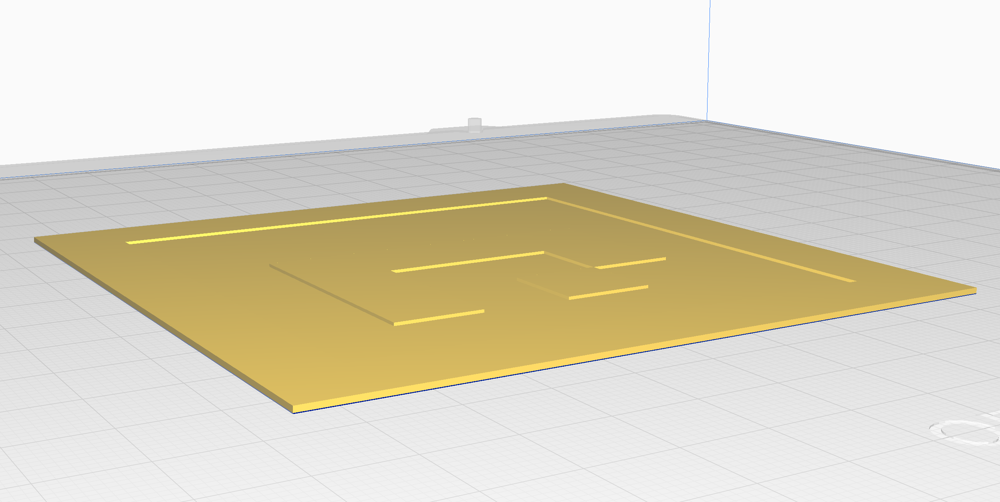
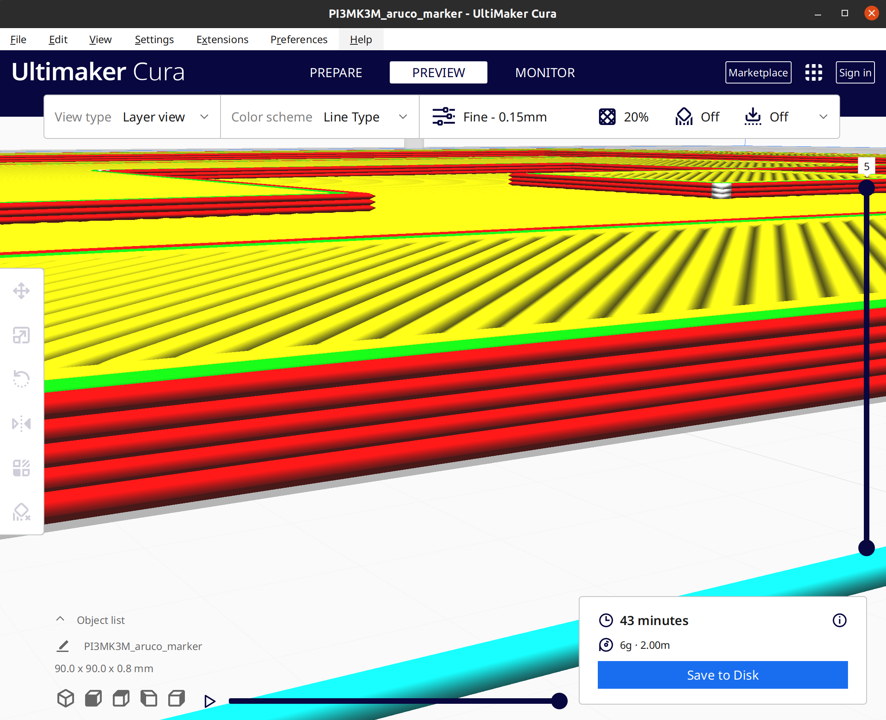

# 3D-aruco-generator

Generate 3D models of aruco markers to 3D print. Renders the aruco as
a square box with grooves for the black squares.

## Requirements

The recommended way to install the requirements is to use a virtual environment:

```bash
python3 -m venv aruco_3d_env
source aruco_3d_env/bin/activate
python3 -m pip install --upgrade pip  # cadquery requires pip upgrade
pip install -r requirements.txt
```

## Usage

To generate an STL file of an aruco marker, run the following command,
and you will be prompted for the marker properties (marker ID, marker size, etc.):

```bash
python3 generate_aruco.py
```

for CLI options, run:

```bash
python3 generate_aruco.py --help
```

## Example

Lets generate an aruco marker with the following properties:

<!-- table -->

| Property | Value |
| -------- | ----- |
| Marker dictionary | DICT_4X4_50 |
| Marker ID | 1 |
| Total side length | 90mm |
| White margin | 10mm |
| Marker thickness | 1mm |
| Groove depth | 0.4mm |

Here is the CLI interaction:

```bash
$ python3 generate_aruco.py
Enter the total side length (marker+margin) (mm) (q to exit): 90
Enter the white margin width (mm) (q to exit): 10
Enter the marker thikness (mm) (q to exit): 1
Enter the groove depth (mm) (q to exit): 0.4
Available Aruco Markers:
0: 4X4_50
1: 4X4_100
2: 4X4_250
3: 4X4_1000
4: 5X5_50
5: 5X5_100
6: 5X5_250
7: 5X5_1000
8: 6X6_50
9: 6X6_100
10: 6X6_250
11: 6X6_1000
12: 7X7_50
13: 7X7_100
14: 7X7_250
15: 7X7_1000
16: ARUCO_ORIGINAL
17: APRILTAG_16h5
18: APRILTAG_25h9
19: APRILTAG_36h10
20: APRILTAG_36h11
Enter the type of marker to generate (q to exit) (Default: ARUCO_ORIGINAL): 0
Enter the marker id (q to exit): 1
Aruco Dictionary: DICT_4X4_50
ArUco Marker 0:
████████████████
██            ██
██            ██
██  ████████  ██
██  ██    ██  ██
██  ██  ██    ██
██            ██
████████████████
```

Or enter them as CLI arguments:

```bash
$ python3 generate_aruco.py --box_side 90 --marker_margin 10 --box_thickness 1 --marker_groove_depth 0.4 --aruco_dictionary DICT_4X4_50 --marker_id 1
Aruco Dictionary: DICT_4X4_50
ArUco Marker 0:
████████████████
██            ██
██            ██
██  ████████  ██
██  ██    ██  ██
██  ██  ██    ██
██            ██
████████████████
```

The generated STL file will be saved as `aruco_marker.stl` in the current directory.



### Layer height

The idea is to have 1 or 2 layers of depth for the groove to paint the marker black.
In our experience paint such as "musou black" vastly improves readability of the marker.
As it prevents the marker from reflecting light.


